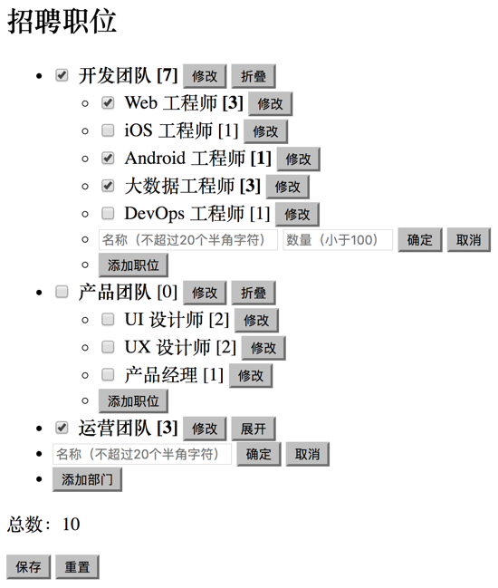

#  Job List 任务说明

实现下图中的 web app

## 需求

尽可能满足以下全部需求，但也可以在放弃若干需求的情况下提交，提交时，请修改这个文档，『勾选』自己觉得已经完成的需求（把 `[ ]` 改成 `[x]`）

### 视觉需求

1. [ ] 示例图中的网页，是没有任何 CSS 的，请尽自己所能，补充样式，完善设计。

### 交互需求

1. [ ] 团队条目有『折叠』和『展开』两种状态，折叠状态下，团队中的职位条目都会被隐藏。
2. [ ] 职位条目可以被『选中』和『取消选中』。
3. [ ] 团队条目可以被『选中』和『取消选中』。当团队条目中有任何职位条目被『选中』时，团队条目自己也会被『选中』。当团队条目被『取消选中』时，它的所有职位条目也都需要被『取消选中』。
4. [ ] 团队条目中的『招聘数量』（示例图中方括号中的数字），等于团队中所有被『选中』的职位条目的招聘数量（示例图中方括号中的数字）的总和。
5. [ ] 可以添加新的团队。添加新团队时，需要输入新团队的名称（不能跟已有团队重复）。
6. [ ] 可以在任何团队里添加新的职位。添加新职位时，需要输入新职位的名称（不能跟所有已有职位重复）和招聘数量。
7. [ ] 任何已存在的团队，都可以修改名称。
8. [ ] 任何已存在的职位，都可以修改名称和招聘数量。
9. [ ] 『总数』等于所有选中的职位的招聘数量之和。

### 数据需求

1. [ ] 从以下 API 加载团队和职位的数据，应用在初始状态时，显示的内容应该跟 API 中的数据完全一致。 \
   API: [https://s.flipchina.cn/api/exercise/job-list.json](https://s.flipchina.cn/api/exercise/job-list.json)
2. [ ] 点击『保存』按钮，要把所有应用状态（比如原有条目和新添加的条目、修改过的条目信息、条目的选中状态、团队条目的折叠状态、……）都做离线的持久化存储（使用 HTML5 API），重新加载（刷新）网页之后，所有应用状态都要能自动恢复，跟刷新前保持一致。
3. [ ] 点击『重置』按钮，要把所有应用状态恢复为初始状态（跟 API 中的数据一致，无选中和折叠状态）

### 工程需求

1. 在 Github 上 fork [dexteryy/webcube-exercise](https://github.com/dexteryy/webcube-exercise) 项目，clone 到本地，按照 README 文档里的步骤进行初始安装、构建和调试，在 [app/job-list](https://github.com/dexteryy/webcube-exercise/tree/master/app/job-list) 目录里进行开发（注意 [app/job-list/index.js](https://github.com/dexteryy/webcube-exercise/tree/master/app/job-list/index.js) 不需要修改）
2. 要求使用 React 和 ES6，不可使用 Redux、MobX 等做应用状态管理的库
3. 要求使用 plain CSS、[SCSS](http://sass-lang.com/)、[CSS in JS](https://speakerdeck.com/vjeux/react-css-in-js) 中任意一种。项目中已启用 [Autoprefixer](https://github.com/postcss/autoprefixer)。对于 plain CSS 和 SCSS，项目中启用了 [CSS Modules](https://github.com/css-modules/css-modules)
4. 不需要写测试
4. 所有代码必须能通过静态检查（`npm run lint`）
3. 最终的实现需要能用 `npm run dev` 或 `npm run build` 运行，在浏览器中通过 http://localhost:8080/job-list/ 查看
3. 把最终实现用 git 提交，push 到自己 fork 的项目里，在回复邮件中提供项目链接

## 学习资源

* 学习资料和资源汇总: https://github.com/dexteryy/spellbook-of-modern-webdev
* Webcube: https://github.com/dexteryy/webcube
